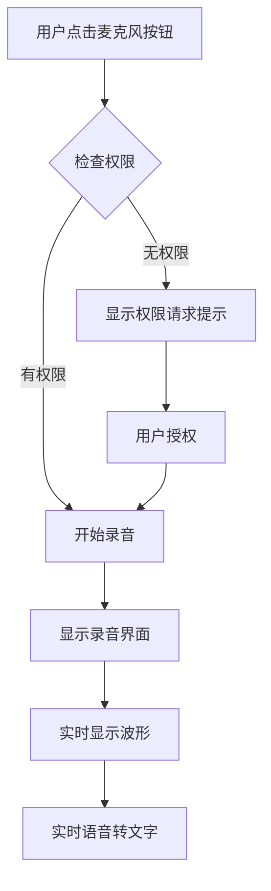
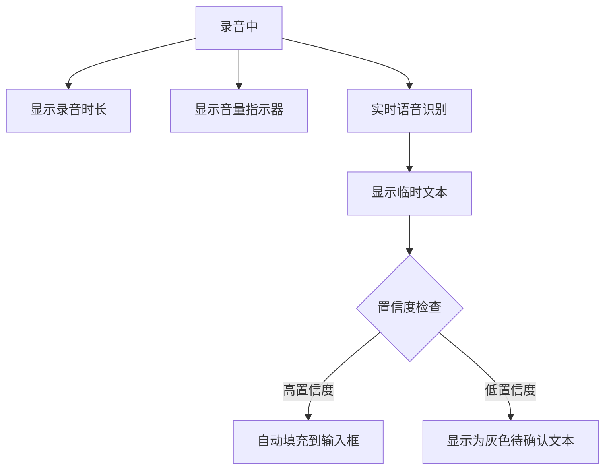
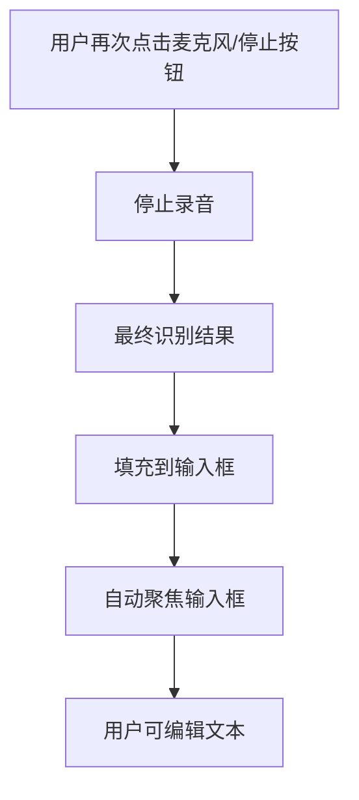
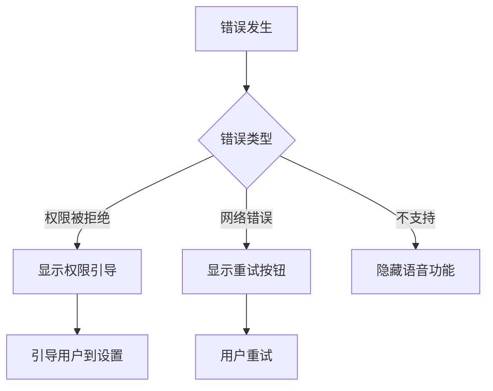

# MiaoDa Chat 语音输入交互流程

## 主要交互流程

### 1. 激活语音输入

### 2. 录音过程

### 3. 结束录音

## 状态转换

### 麦克风按钮状态
1. **默认状态**: 灰色麦克风图标
2. **悬停状态**: primary色高亮
3. **录音状态**: 红色背景 + 脉冲动画
4. **禁用状态**: 半透明 + 禁用光标

### 录音界面状态
1. **展开动画**: slideDown 0.3s ease-out
2. **录音中**: 显示波形 + 计时器
3. **收起动画**: slideUp 0.3s ease-out

## 错误处理流程

## 快捷键支持
- **Ctrl/Cmd + Shift + M**: 切换语音输入
- **Esc**: 取消当前录音
- **Enter**: 确认语音输入结果